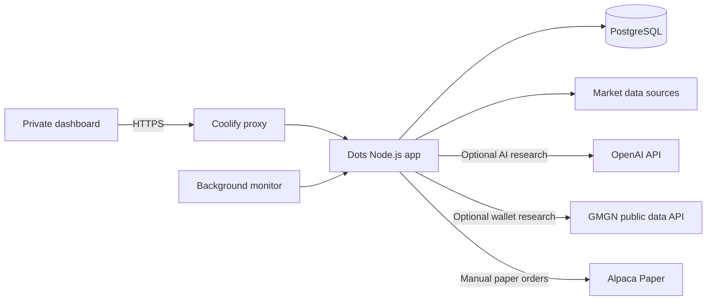

# DotsTrading

**A private market research and paper-trading desk for your VPS.**

<p align="center">
  
</p>

DotsTrading brings market monitoring, six agent roles, experimental strategy learning, and isolated trading simulations into one dashboard. Deploy it through Coolify with Docker Compose and PostgreSQL. AI research runs through your own OpenAI API connection; optional GMGN wallet research uses public Solana trading data.

**Node.js 22+ · PostgreSQL 17 · Docker Compose · MIT License**

[Deploy with Coolify](#deploy-with-coolify) · [Testing setup](#testing-setup) · [Agent lab](#agent-lab) · [Wallet research](#wallet-research-with-gmgn) · [Configuration](#configuration) · [Data migration](#data-migration) · [Troubleshooting](#troubleshooting)

## What you can do

| Capability | How it works |
| --- | --- |
| Market monitoring | Collects quotes and reports actual collection attempts, successes, failures, cadence, and scheduler ownership. |
| Six agent roles | ATLAS, ORION, TITAN, NOVA, VEGA, and LUNA cover evidence, research, signals, sizing, and risk. |
| AI research | Runs six sequential model reviews using timestamped price history, modeled costs, return estimates, downside scenarios, and recent outcomes. Requires an OpenAI API key and sufficient observed market history. |
| Wallet research | Discovers public GMGN smart-money wallets and compares a watchlist with reported PnL and recent Solana trade history. Requires a GMGN API key. |
| Adaptive research | Scores recorded forecasts against future observations and adjusts experimental strategy weights after enough outcomes. |
| Agent lab | Scores individual AI forecasts and tests frozen model and policy cohorts with isolated paper probes and a matched baseline. |
| Testing setup | Guides AI connection, market selection, measured monitoring, history collection, and the first paper experiment. |
| Isolated simulation | Compares adaptive and fixed-momentum virtual accounts with modeled spreads, fees, and risk limits. |
| Paper brokerage | Supports authenticated manual proposals through the locked Alpaca Paper endpoint. |
| Searchable memory | Archives research, forecast outcomes, trade lessons, and agent decisions in PostgreSQL with full-text and symbol search. |
| Readiness checks | Reports functional simulation checks, all six agent histories, quote freshness, configuration, and evidence gaps. |
| Performance comparison | Separates realized and unrealized net results, fees, returns, and sampled drawdown for both virtual accounts. |

**Execution scope:** background monitoring does not submit broker orders. AI reports do not change risk limits or place broker orders. Simulated fills are separate from the main account and brokerage. Research and simulation results do not establish future profitability.

The active desk keeps bounded recent history; the memory archive persists research, scored forecasts, and simulated trade lessons separately. Detailed decision records are retained for 14 days. Hindsight, vector search, and model retraining are not included.

## Architecture



The dashboard, API, and optional scheduler run in the `dots` service. PostgreSQL runs in the `postgres` service with a persistent `dots-data` volume. Only the app needs a public domain; keep the database private.

## Evidence workspace

The sidebar groups all dashboard sections into **Workspace**, **Research**, **Trading**, **Safety**, and **Settings**. It collapses on desktop and opens as a drawer on smaller screens. Memory, readiness, and performance links select their corresponding tabs; risk settings, AI connection, and GMGN connection links open the setup dialogs. Use **Testing setup** to prepare a paper experiment, and **Research → Wallet research** for the wallet watchlist. Ledger export and sign-out stay at the bottom of the menu.

The **Desk Evidence & Readiness** panel has five views:

- **Agent activity:** recorded task results, timestamps, quote and sizing inputs, citations, recent research reviews, and memory/handoff counts. A forecast scorecard compares recent Brier error with a constant 50% forecast and shows calibration bins with their sample support. Waiting, vetoed, and stale activity are labeled explicitly.
- **Memory:** search by keyword or symbol, then filter by agent and record type. Expand a result to inspect its supporting evidence and outcome. Use **Archive available history** to backfill the history still present in the desk.
- **Readiness:** run isolated synthetic checks and save a snapshot of current configuration and evidence. Warnings identify missing prerequisites; failures identify broken checks. This does not contact AI providers or execute orders.
- **Performance:** compare equal-capital virtual accounts after modeled fees. Realized net results remain visible when stale position marks make total equity unavailable. Both accounts need at least 30 closed trades before the report labels the comparison preliminary; that threshold does not establish statistical significance.
- **Validation:** manually select a momentum candidate using earlier recorded bid/ask observations, freeze its settings, and test on the later period. The report compares net results with a buy-and-hold baseline and includes modeled fees, spread and adverse slippage. It requires at least 120 valid observations per symbol and does not modify the active strategy. This is one chronological holdout, not independent validation of all six agents or proof of profitability.

Each AI review receives up to three role-prioritized archived reviews, simulated trade lessons or scored forecasts for the current primary symbol, and can cite their archive IDs. Earlier agents' replies are passed to later reviews, and that handoff is recorded. Simulation decision records also include recent outcome summaries for explanation. Memories remain untrusted evidence; retrieval does not change execution permissions, strategy weights, or risk limits. Trade lessons describe observed outcomes, not proven causes.

No existing history can be recovered after it has already been discarded. Archive capture begins with available records after this version is installed, and continues on monitoring cycles and completed research rounds. The archive uses PostgreSQL full-text search without embedding API charges. AI calls that include retrieved context still incur normal provider charges.

## Testing setup

Open **Testing setup** and complete the steps in order. The panel reports observed prerequisites; enabling a setting alone does not make a test ready.

1. **Connect AI.** Add your OpenAI API key through **API Setup** or Coolify runtime configuration. The programmed workflow preview makes no AI calls. A ChatGPT subscription does not include API usage.
2. **Choose a market.** Select a supported stock or crypto target, or use **Auto** and inspect the chosen target. It needs a fresh, uncached bid/ask book with valid source and collection timestamps and a spread of at most **0.5%**. Check provider access and market hours if quotes are stale; selecting a symbol does not create data.
3. **Verify measured monitoring.** On your VPS, set `MONITOR_ENABLED=true` and use a **60-second** interval, then redeploy. Wait for an active scheduler owner, at least **two successful collections**, an observed interval of at most **120 seconds**, and a successful collection and scheduler heartbeat within **150 seconds**. Failure or lost ownership clears paper readiness. The hosted Sites dashboard supports manual testing while its signed-in tab stays visible and its measured browser collection is ready; it has no background scheduler.
4. **Collect usable history.** The selected market needs at least **12 distinct source quotes** in the last **30 minutes**, spanning at least **10 minutes**, with no gap over **five minutes**. Repeated cached quotes do not increase the count. Let real collection continue until the history and current-book checks pass.
5. **Start and test.** Start the isolated experiment in **Agent lab**, then separately select **RUN AI RESEARCH** in **Research Room**. Keep collection running through the forecast deadline so forward scores and paper exits can be observed. Starting the lab does not start paid AI calls or submit orders.

**Scheduled AI requires verified VPS background monitoring**, including when no Agent lab experiment is running. A visible hosted tab cannot qualify as a background scheduler. If history or required monitoring is not ready, Dots reports the missing prerequisite before reserving an AI round or making AI provider requests. Manual AI rounds with an active paper experiment require measured browser or VPS monitoring.

A completed paid round still uses **six model requests**, with a configurable **1–4 daily round cap** and at most hourly scheduled rounds. The cap resets at midnight in Europe/Stockholm. Model inputs include at most **30 timestamped history rows**; the richer context can increase input-token charges. The round cap bounds requests, not dollar cost. Set billing limits with your AI provider.

Research uses actual source times and collection times. Its price return, elapsed-time trend, and sample volatility describe the observed history; irregular quotes are not treated as uniform candle bars. The evidence packet includes a break-even move calculated from the observed bid/ask and modeled fees and slippage, plus a stress budget that doubles spread, fees, and slippage assumptions. Trade volume, independent news, holidays, and halts remain unknown when no verified source supplies them. The agents are instructed to abstain rather than invent missing evidence.

## Agent lab

Open **Research → Agent lab** to inspect the six AI reviewers' individual forecasts, Brier error (lower is better), forecast coverage, and calibration. Results are separated by model and policy version. **SAGE** reviews existing outcome records; **AEGIS** audits paper timing, modeled costs, and the paired benchmark. These two specialists are programmed checks and make no additional AI requests themselves. Complete [Testing setup](#testing-setup) before starting an experiment.

New experiments use **`research-shadow-v2`**. The first eligible report freezes the model, **`agent-skill-v2`**, **`research-context-v2`** prompt, and **`net-return-v1`** forecast cohort. Reports from a different model or cohort do not enter that experiment. Only new, successfully completed AI rounds contribute; programmed previews and failed rounds are excluded. Existing version 1 experiments retain their stored policy and timing instead of being relabeled as version 2.

The first four reviewers' forecasts begin with equal blend weights. After each has at least **20 scored forward outcomes**, the policy uses gently adjusted Brier weights shrunk toward equal weighting, with no reviewer receiving more than **40% of the full four-role weight snapshot**. Available contributors are normalized for a round. Weights are frozen before each six-call round. This updates an experimental forecast policy; it does not retrain the underlying AI model or enable brokerage execution.

Each eligible report can create an isolated **$60 paper probe**, paired with an equally sized always-long benchmark. Version 2 reviews estimate the gross midpoint return over the report's one-hour forecast horizon, bounded to **−25% to +25%**, and a plausible adverse scenario bounded to **−25% to 0%**. These are model estimates, not promised returns or guaranteed downside limits.

A long probe requires a blended probability of at least **0.60**, six completed non-abstaining reviews, no risk veto, and an expected return strictly above the modeled break-even move plus **0.15 percentage points**. All six reviewers must provide a valid downside estimate whose loss is no greater than the frozen **3%** limit; the four forecasting reviewers also need valid return estimates. If the report does not pass the long policy, its paper policy stays flat while the matched always-long benchmark records the same opportunity.

The entry book's source timestamp must be at least **15 seconds after the AI round finishes**, with a valid recorded collection time. The entry window ends **10 minutes** after that delay, or just before the report deadline if it comes first. No qualifying book means the pending entry expires. Version 2 exits use the first valid book at or after the original forecast deadline: **one hour from the report's start**, not one hour after entry. A delayed or unavailable exit leaves the probe open and visible. Legacy **`research-shadow-v1`** probes retain their stored entry-based holding period.

Version 2 freezes the original reference midpoint, predicted terminal midpoint, and worst reviewer downside scenario. At the genuinely later entry book, it rechecks the remaining expected return against that book's modeled break-even move plus **0.15 percentage points**, and recalculates the worst downside relative to entry against the **3%** limit. A consumed opportunity or failed entry check leaves the paper policy flat while the benchmark still enters. Both the original forecast decision and entry audit are recorded. This entry cost check assumes the relative spread persists; actual exit costs use the later observed book.

The model uses recorded bid/ask prices, **0.1% fees per side**, and **10 basis points of adverse slippage**. These are simulated trades, not verified broker fills or a portfolio equity curve: independent probes do not share a cash balance. Realized gains and losses appear after one matched pair closes. Fewer than **30 closed pairs** means insufficient evidence; 30 or more is preliminary evidence, not proof of profitability.

An experiment allows at most **100 probes**, with at most **10 pending or open** at once. Pause cancels pending entries and continues checking open-probe exits. Start a new experiment only after open probes close; up to two previous experiment summaries are retained. Forecast storage is bounded to **600 records** while unresolved forecasts remain protected. Migration pauses the experiment, and exports preserve its metadata without provider credentials. No result automatically promotes a policy to trading.

Agent lab evaluates stock and crypto AI research already supported by the desk. The separate GMGN workspace remains read-only Solana wallet research; it is not a copy-trading experiment.

## Wallet research with GMGN

Use this workspace to discover and evaluate public Solana wallets before considering a strategy. Dots calls the official GMGN data API directly; installing the GMGN CLI is unnecessary. It uses an API key for public smart-money discovery, wallet activity, and PnL. Personal GMGN follow-list synchronization, signed holdings queries, and live copy trading are not included. Dots does not accept or store a GMGN private signing key or wallet seed phrase.

### Create and connect an API key

1. Sign in to Dots and open **Settings → GMGN connection**. Generate the public key for your GMGN application. The browser downloads the matching private signing PEM for you to keep locally; Dots does not upload or save that private key. This authentication key pair is separate from your crypto wallet keys.
2. Open the provided [GMGN API creation link](https://gmgn.ai/ai/generateapi) and sign in to your own GMGN account. The link supplies the public key. If copying it manually, include the full PEM with its `BEGIN PUBLIC KEY` and `END PUBLIC KEY` lines. See the [official key guide](https://docs.gmgn.ai/index/generate-public-key).
3. Create your GMGN API key. GMGN controls eligibility: if its Free plan shows “requires ≥$100 balance”, key creation is blocked until the account meets that requirement. Check GMGN for which wallet and assets count. The message describes a balance requirement, not a Dots charge. GMGN is optional; Agent lab and the rest of Dots work without it. If GMGN offers permission choices, select data access and leave trading disabled. GMGN supports IPv4 API requests; ensure your VPS has working IPv4 outbound access. Account eligibility and current plan limits are determined by GMGN.
4. Paste only the API key into the authenticated Dots connection dialog and save it, or set **`GMGN_API_KEY` as a Coolify runtime secret** and redeploy. Never commit a real key. Browser setup encrypts the saved API key using the existing `RESEARCH_ENCRYPTION_KEY`; preserve that master key when updating the app.
5. Open **Research → Wallet research**, discover public smart-money wallets or add a public Solana address, then select a wallet and request its 7-day or 30-day analysis. Use **Load recent trades** for a separate history sample.

The watchlist holds up to **10 wallets**. Research requests are manual, with at least **10 seconds between provider calls** and a ceiling of **100 calls per UTC day**. Provider limits may be lower; Dots pauses requests during a rate-limit cooldown. Each discovery, connection check, PnL analysis, or recent-trade request uses a provider call; cached views do not. Background market monitoring does not continuously poll the wallet workspace.

Reports compare **7-day and 30-day reported realized PnL** and inspect a bounded recent trade history. A missing value remains unknown. A provider's history may omit earlier trades, transfers, other chains, or activity outside its coverage, so the report is not a complete account audit. A profitable wallet's past results do not establish that copying it would be profitable: followers enter later and may pay different fees or receive different prices.

This connector does not create simulated copy-trade profits. A future paper-copy experiment needs an execution model using the observed signal delay, available liquidity, fees, and adverse slippage before its returns can be compared with the leader's reported results. Dots does not submit wallet trades or broker orders from this workspace.

The provider contract was reviewed against the official MIT-licensed [GMGNAI/gmgn-skills](https://github.com/GMGNAI/gmgn-skills/tree/4575ef539e6a3115fa0481d41285cb79e77970bf). GMGN service access and data use remain subject to its own terms and plans. This repository contains application code and placeholder configuration; no personal watchlists, account data, or real wallet reports are committed.

## Deploy with Coolify

### 1. Prepare your environment

You need a Linux VPS with Docker and Coolify, a GitHub source connected to Coolify, and an HTTPS domain for the app. Coolify can assign a domain if your installation supports it.

A VPS with **2 CPU cores and 8 GB RAM** is a reasonable starting point for this app and PostgreSQL; AI inference runs through an external API. Allow additional capacity for Coolify, other services, backups, and image builds. GitHub changes appear on your VPS only after you deploy the new commit.

Clone the repository on a machine with **Node.js 22+ and OpenSSL** to generate the required secrets:

```bash
git clone https://github.com/bennymalonee/tradedots.git
cd tradedots
```

### 2. Generate your secrets

Run each command separately in a private terminal. Save its output in your password manager and the matching Coolify runtime variable.

**Database password → `POSTGRES_PASSWORD`**

```bash
openssl rand -hex 32
```

**API-key encryption master key → `RESEARCH_ENCRYPTION_KEY`**

Generate this only for a new installation. If the app already has an encryption master key, keep its existing value when adding GMGN or updating the app.

```bash
openssl rand -base64 32
```

**Owner password hash → `OWNER_PASSWORD_HASH`**

Use Bash for the following commands. The password prompt hides your input; the script prints only the hash. No dependency installation is needed for this script.

```bash
read -r -s -p 'Choose an owner password (at least 16 characters): ' dots_password
printf '\n'
printf '%s' "$dots_password" | node scripts/password-hash.mjs
unset dots_password
```

Use your original password to sign in. Store the generated hash in Coolify.

### 3. Create the Coolify resource

1. Create a resource from the connected GitHub repository.
2. Select branch **`main`**, build pack **Docker Compose**, and compose file **`/docker-compose.yml`**. The base directory is the repository root.
3. Assign an **HTTPS domain** to the `dots` service, targeting container port **`3000`**.
4. Add the required variables from [Configuration](#configuration). Set `APP_ORIGIN` to the exact HTTPS origin, such as `https://dots.example.com`, without a path or trailing slash.
5. Keep `MONITOR_ENABLED=false` during initial setup. Set the app health-check path to **`/healthz`**.
6. Deploy and wait for both services to become healthy.

Set credentials as **runtime secrets**, not build arguments. Do not publish a database port or assign a domain to `postgres`.

### 4. Choose how to initialize the desk

**Fresh installation:** open the app domain, sign in, and review the dashboard. A new database starts with the default virtual account.

**Existing installation:** complete [Data migration](#data-migration) **before opening the dashboard**. Reading the desk initializes an empty account, and the importer refuses to overwrite existing state.

### 5. Connect providers and enable monitoring

After verifying the desk, set `MONITOR_ENABLED=true` and `MONITOR_INTERVAL_SECONDS=60` in Coolify and redeploy. The scheduler runs sequential cycles with at least 60 seconds between completed cycles. One app instance owns the PostgreSQL scheduler lock; waiting replicas retry, and a lost connection releases readiness until ownership and successful collection recover. Dashboard refreshes can also request updates; shared state prevents overlapping collection. **Testing setup** shows attempts, successes, failures, skips, measured cadence, owner state, heartbeat, and next due time.

For AI research, add `OPENAI_API_KEY` in Coolify or use **API Setup** after signing in. Follow [Testing setup](#testing-setup) to select a market and collect sufficient real history before the first AI round. The free workflow preview uses programmed checks and does not call an AI model.

For optional wallet research, add `GMGN_API_KEY` in Coolify or use **Settings → GMGN connection**. Follow [Wallet research with GMGN](#wallet-research-with-gmgn) for key creation and call limits. This connection does not require enabling the background monitor.

Scheduled paid AI research stays off until you explicitly enable it in the dashboard. All scheduled rounds require verified minute monitoring on the VPS, even without an active experiment. The configurable daily round cap bounds requests, not a fixed dollar amount. Set provider billing limits separately.

## Configuration

Use [`.env.example`](.env.example) as a reference. Real values belong in Coolify runtime configuration.

### Required

| Variable | Value | Handling |
| --- | --- | --- |
| `APP_ORIGIN` | Exact HTTPS origin assigned to `dots` | Runtime configuration |
| `POSTGRES_PASSWORD` | Random hex generated above | Secret; hex avoids URL-escaping issues |
| `OWNER_PASSWORD_HASH` | Output of the password-hash script | Secret; never use the plaintext password here |
| `RESEARCH_ENCRYPTION_KEY` | Base64-encoded random 32-byte key | Secret; back up separately from the database |

Docker Compose builds `DATABASE_URL` from the database configuration. You do not need to set it separately for this deployment.

### Optional

| Variable | Default | Purpose |
| --- | --- | --- |
| `MONITOR_ENABLED` | `false` | Enables the background monitor when set to `true` |
| `MONITOR_INTERVAL_SECONDS` | `60` | Delay between cycles; values below 60 are clamped. Paper readiness also requires measured cadence of at most 120 seconds. |
| `OPENAI_API_KEY` | Empty | AI research provider credential |
| `OPENAI_RESEARCH_MODEL` | `gpt-4.1-mini` | Research model; requires access on your API account |
| `GMGN_API_KEY` | Empty | Official GMGN public wallet research credential; never supply a private signing key |
| `ALPACA_API_KEY` | Empty | Alpaca Paper and market-data credential |
| `ALPACA_API_SECRET` | Empty | Matching Alpaca credential secret |

The Compose configuration locks the broker endpoint to `https://paper-api.alpaca.markets/v2`. OpenAI API usage is billed separately from ChatGPT subscriptions. VPS, backup storage, and provider charges depend on your services.

## Authentication and private data

Dots uses a single owner password with salted scrypt verification. Successful login creates an eight-hour session; PostgreSQL stores the token hash. Production cookies are `HttpOnly`, `Secure`, and `SameSite=Strict`. Logout revokes the session, and login throttling persists across restarts.

Private dashboard and API requests require a session. State-changing requests also require the configured origin. The public `/healthz` endpoint reports service readiness without exposing desk data. Multi-user roles, password recovery, and MFA are not implemented.

API Setup verifies model access and encrypts saved AI keys with AES-256-GCM. GMGN connection setup uses the same encryption master key for its saved API key. Saved credentials are not returned to the browser or included in state-transfer exports. Keep `RESEARCH_ENCRYPTION_KEY` stable: replacing it makes previously saved keys unreadable.

Commit application code and placeholder configuration only. Keep passwords, provider keys, certificates, database dumps, exports, and account snapshots outside Git. Ignore rules help prevent accidental inclusion but do not detect every possible secret.

## Data migration

Use a **full desk-state snapshot** when moving an existing installation. The dashboard ledger export is useful for analysis but does not contain everything needed to restore an account. To move an existing searchable memory archive as well, restore a complete PostgreSQL backup: state snapshots do not include the separate `agent_memory` table.

1. Pause source monitoring, simulation, scheduled AI research, and external automation before taking the final snapshot.
2. Export the full state. For a Sites installation, obtain the JSON stored in `desk_state.payload` through its database administration tools. Remove saved provider credentials before transferring it; reconnect AI and GMGN keys at the destination.
3. Deploy the destination with `MONITOR_ENABLED=false`. Keep its database empty and do not open the dashboard yet.
4. Transfer the snapshot privately into the `dots` container, at a path readable by the app user. In the app terminal, run:

   ```bash
   node scripts/state-transfer.mjs import /tmp/dots.backup.json
   ```

5. Delete the temporary snapshot. Check balances, positions, agent history, simulation records, and broker reconciliation. Reconnect credentials and explicitly resume the relevant controls before enabling the scheduler.

Import preserves history and experiment metadata, pauses the destination desk, simulation, and Agent lab, disables scheduled AI research, and clears old task leases. It discards the source's monitoring heartbeat and ownership records; the destination must earn readiness through its own successful collections. It refuses to overwrite an existing account. Keep the source available until verification is complete, and avoid running two active schedules against the same accounts.

## Backups and maintenance

The `dots-data` volume survives normal redeployment. Deleting that volume deletes the database; it is not a backup.

Schedule daily PostgreSQL backups to storage outside the VPS. Use Coolify's backup features if available for your resource type, or an external `pg_dump` job. Protect database dumps, back up the encryption key separately, and test restoration.

To create a portable state snapshot, run this in the app container:

```bash
node scripts/state-transfer.mjs export /tmp/dots.backup.json
```

The exporter excludes saved provider credentials and refuses to overwrite an existing file. Download the snapshot privately, then remove the temporary copy. This supplements full database backups; it does not include the memory archive, session, or login-throttling tables.

Before updating the app, take a backup and review the changes. Redeploy the desired commit through Coolify, then check service health and dashboard data.

## Troubleshooting

| Symptom | What to check |
| --- | --- |
| Compose reports a missing variable | Set all four required variables in Coolify runtime configuration. |
| Login returns `403` or requests return `421` | Match `APP_ORIGIN` to the browser's exact HTTPS origin and ensure the proxy forwards that domain as the Host header. |
| Login returns `401` | Use the original owner password, and verify that `OWNER_PASSWORD_HASH` contains the generated scrypt hash. |
| Login returns `429` | Wait until the 15-minute login-limit window expires. |
| Database or app remains unhealthy | Check `postgres` logs and its health check. Changing the password variable alone does not change a password in an already initialized database. |
| Import says the destination is not empty | Use a separate empty destination database. Back up existing data; the importer intentionally does not overwrite it. |
| Quotes are missing or stale | Check source status, market hours, provider credentials, and any rate-limit retry time. |
| AI research waits for quotes | Check the selected target, source and collection times, spread, market hours, and provider access in Testing setup. |
| AI research waits for history | Collect 12 distinct recent source quotes over at least 10 minutes. Repeated timestamps, invalid books, and cached data cannot satisfy the history gate. |
| AI research waits for monitoring | Verify actual collection successes and cadence. Scheduled rounds require the VPS owner and current heartbeat; a hosted browser tab supports manual testing only. |
| A paper probe stays flat | Read its forecast decision and entry audit. Version 2 needs adequate direction confidence, bounded return/downside estimates, sufficient remaining edge after actual entry-book costs, and no risk veto. |
| A paper exit remains open | Keep measured collection running. A missing or stale book cannot supply an exit; version 2 waits for a qualifying quote after the report's original forecast deadline. |
| A saved AI key cannot be opened | Restore the matching encryption master key or reconnect the API key through API Setup. |
| GMGN key creation says `Insufficient balance` | GMGN applies a qualifying balance requirement to that account. Check its current plan rules; leave wallet research disconnected if you do not want to meet that requirement. |
| GMGN is disconnected | Save an API key through GMGN connection setup, or set `GMGN_API_KEY` in Coolify and redeploy. |
| GMGN returns `401` or `403` | Check the key, account access, and IPv4 outbound connectivity. |
| GMGN requests are paused | Wait for the displayed cooldown or daily reset. Repeated requests do not clear the provider's limit. |
| A saved GMGN key cannot be opened | Restore the matching `RESEARCH_ENCRYPTION_KEY` or reconnect the API key; do not generate a replacement master key as a routine fix. |
| Background monitoring is inactive or stalled | Check `MONITOR_ENABLED=true`, the 60-second interval, app/database logs, and scheduler ownership. Configuration alone is insufficient; Testing setup needs measured successes, cadence, and a current heartbeat. Failed cycles retry without placing orders. |

## Development

Install dependencies, build the embedded application, and run the VPS checks:

```bash
npm ci
npm run build
npm run test:vps
```

To run locally, configure a PostgreSQL `DATABASE_URL`, the required owner-password hash, encryption key, and `APP_ORIGIN` before `npm start`. For local HTTP testing only, `NODE_ENV=development` permits an HTTP origin and non-Secure cookies. Production requires HTTPS.

| Path | Contents |
| --- | --- |
| `web/` | Dashboard, styles, assets, and agent animations |
| `worker/` | Market APIs, paper engine, learning, simulation, and AI research |
| `server/` | Node.js server, PostgreSQL adapter, authentication, and VPS checks |
| `scripts/` | Build, password-hash, and state-transfer utilities |
| `docker-compose.yml` | Coolify app and PostgreSQL services |

## License

Released under the [MIT License](LICENSE).
